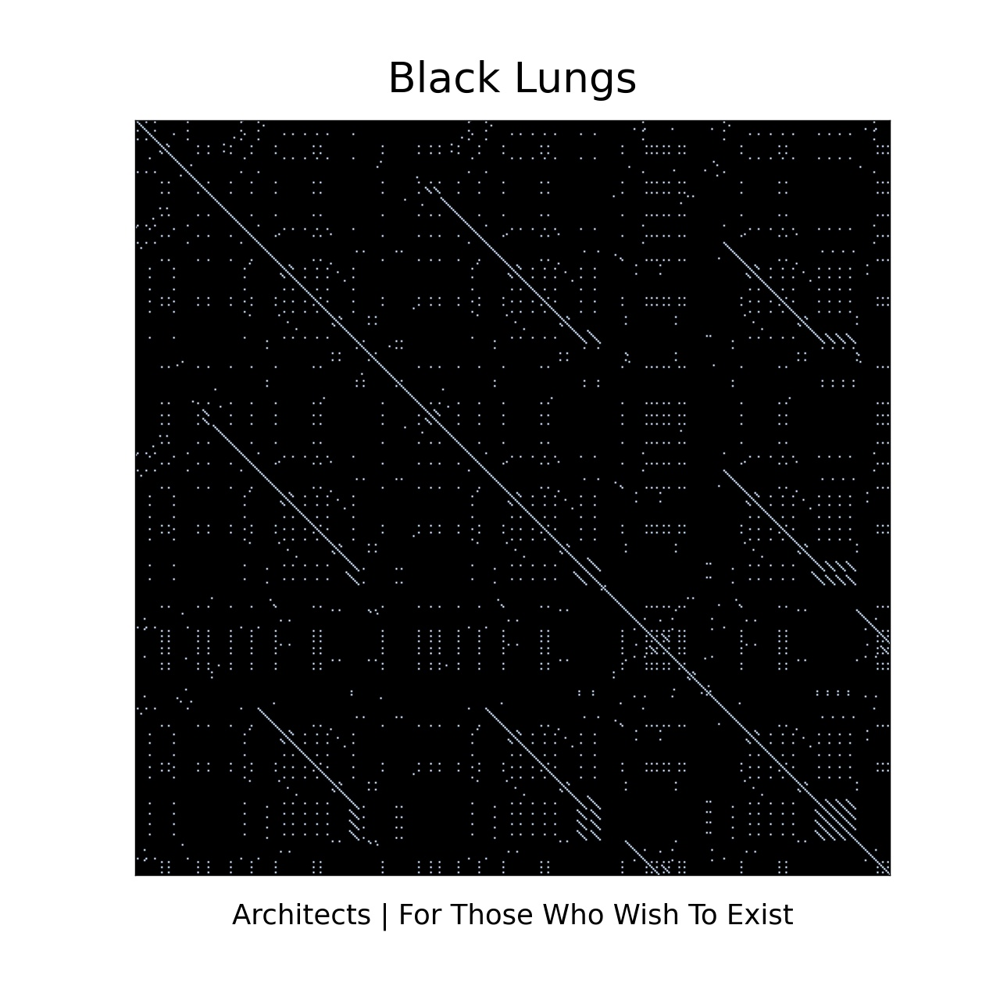
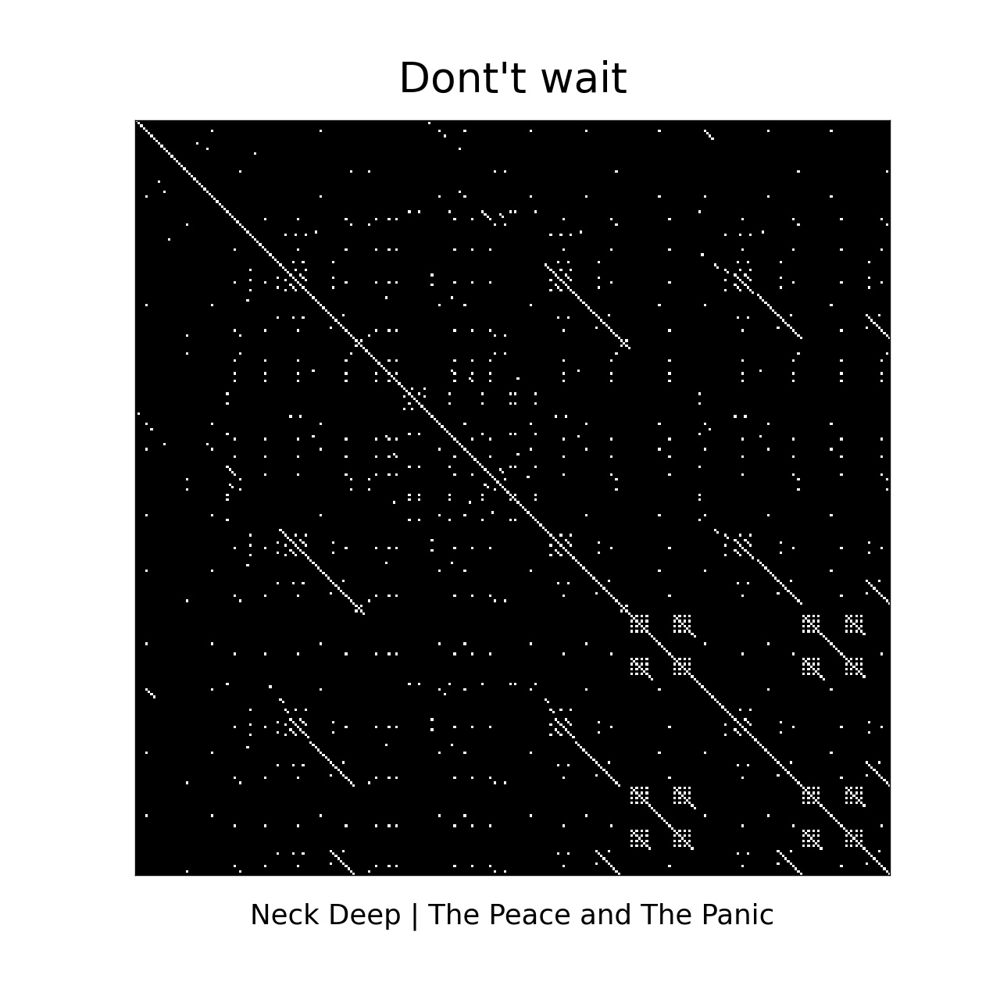
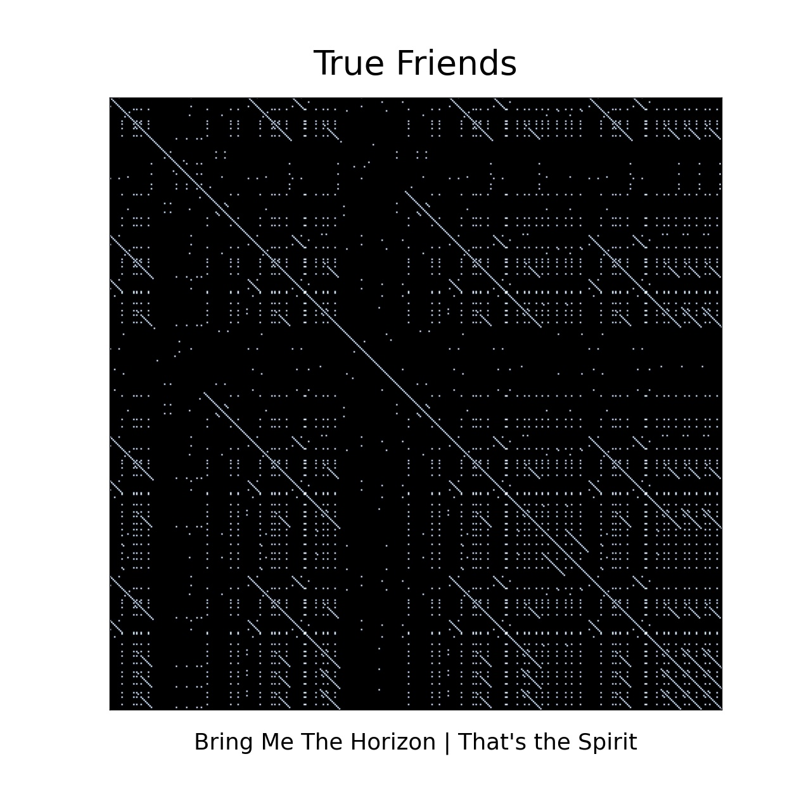
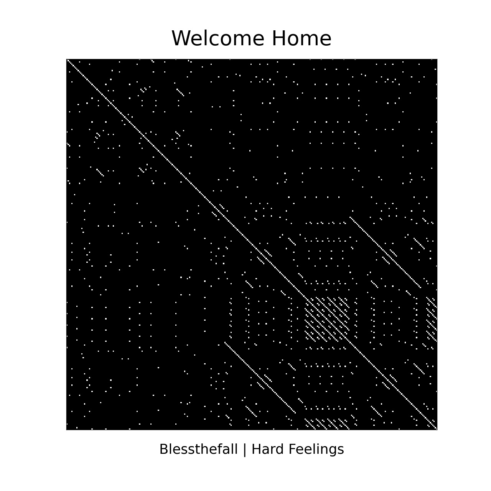

# Autosemejanza en las Letras de Canciones

Las letras de las canciones son una parte importante en la música actual. Muchísimas canciones siguen patrones que, de alguna u otra forma, pueden jugar una parte esencial en la experiencia de quien las escucha. La repetición de palabras o frases enteras es común, y generalmente añaden un sentido de coherencia a las canciones. Para vizualizar estos patrones, podemos usar matrices de autosemejanza. En este cuaderno de Jupyter podran encontrar una manera sencilla de obtener estas matrices para las letras de las canciones que ustedes deseen. Acá hay unos ejemplos de lo que pueden lograr: 

