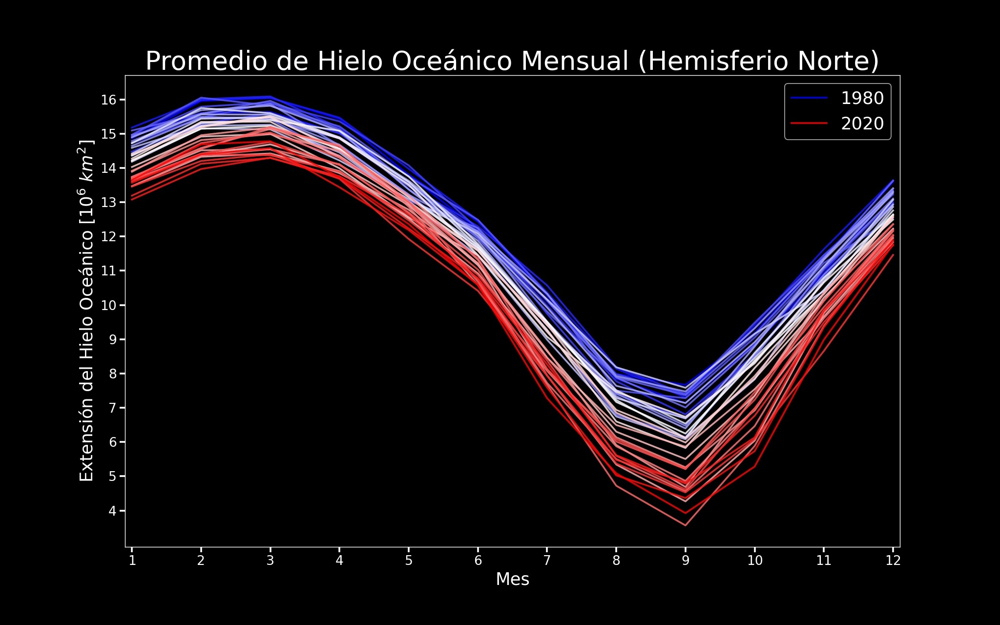

# Extensión del Hielo Oceánico

La cantidad de hielo oceánico que se encuentra en los casquetes polares varia durante el año de acuerdo a las estaciones. Sin embargo, el calentamiento global ha causado que cada año se observen menos cantidades de hielo. En este ejemplo, creamos una gráfica que demuestra esta dismunición gradual de hielo oceánico, usando datos de acceso público. Este es el resultado:

